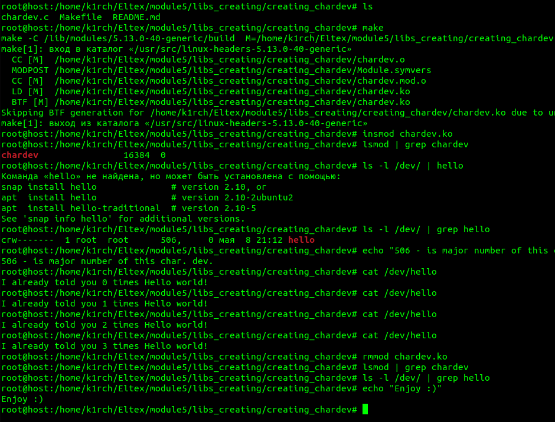

# LIBS_CREATING
 
+---- ./libs_creating/creating_chardev/chardev.c ----+ 
 
</img> 
Usage: 
$ sudo su 
# make 
# insmod chardev.ko 
# lsmod | grep chardev 
# cat /dev/hello 
Output will be: I already told you %d times Hello world! 
were %d - number of starts this character device 
+--- Deleting kernel module ---+ 
# rmmod chardev.ko 
# make clean 
 
+---- Enjoy ----+
