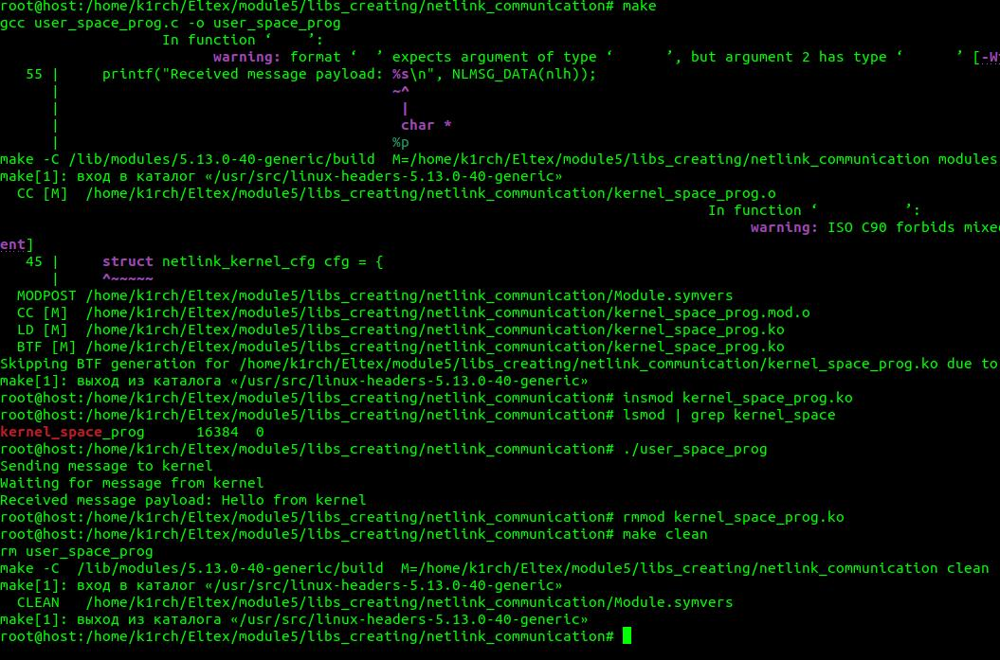

# LIBS_CREATING
 
+---- ./libs_creating/netlink_communication/kernel_space_prog.c && user_space_prog ----+  
Description: Netlink allows the user to use /sys/socket.h to communicate through the kernel rather than through protocols 
</img> 
Usage: 
$ sudo su 
# make 
# insmod kernel_space_prog.ko 
# lsmod | grep kernel_space 
# ./user_space_prog 
+--- Deleting kernel module ---+ 
# rmmod kernel_space_prog.ko 
# make clean 
 
+---- Enjoy ----+

