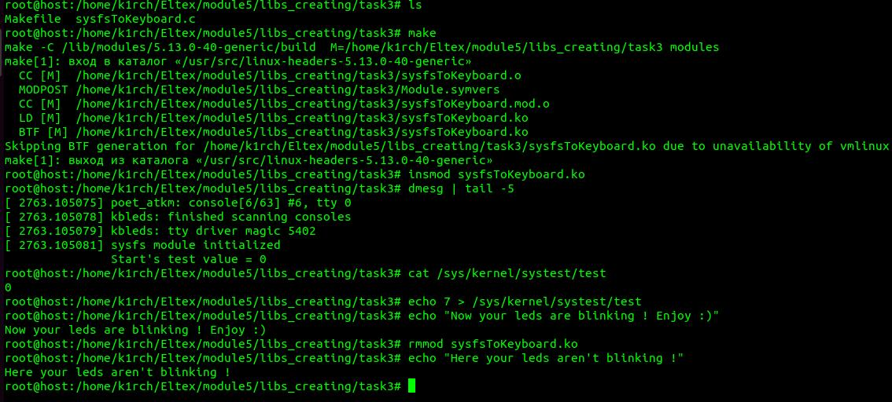

# SYS-PROG & LIBS_CREATING
 
+---- ./libs_creating/sysfsToKeyboard.c ----+
 
Description: This program makes kernel module in linux 
 
</img> 
Usage: 
$ sudo su 
# make 
# insmod sysfsToKeyboard.ko 
Now this module is active 
# dmesg | tail -5 // for show logs 
# cat /sys/kernel/systest/test (output would be 0) 
# echo 7 > /sys/kernel/systest/test 
As a result, you should watch the blinking LEDs on your keyboard! 
 
+--- Deleting module ---+ 
# rmmod sysfsToKeyboard.ko 
# make clean 
 
 
+---- Enjoy ----+
