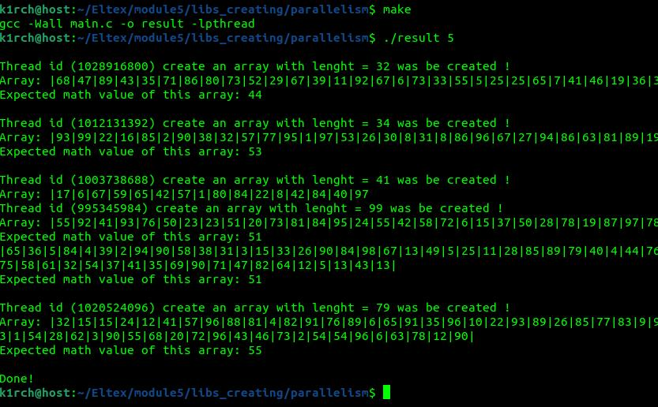

Статистический анализ. Имеется несколько массивов данных (разного размера).
Требуется определить математическое ожидание в каждом массиве.
Обработка каждого массива выполняется в отдельном процессе.

Параметр определяющий число потоков, как и число массивов передается в argv.

Usage: 
$ make 
$ ./result your\_number\_here (ex.: 5) 
 
</img> 
 

